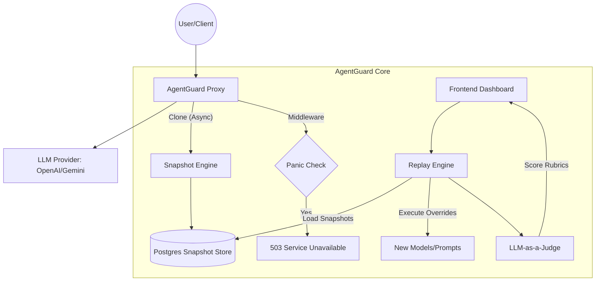

# 🛡️ AgentGuard: The AI Reliability Platform

This document serves as the master blueprint for AgentGuard, outlining the vision, architecture, and implementation phases.

## 👤 Vision
**Target**: The AI Product Engineer who fears "Silent Regressions."
**Mission**: Move AI deployment from "Vibe-testing" to "Scientific reliability." AgentGuard is the infrastructure layer (The "Vercel for Agents") that makes AI updates predictable and safe.

---

## 🏗️ High-Level Architecture

---

## 🛠️ Implementation Phases

### Phase 1: Safe Harbor (The Engine) - ✅ COMPLETED
*   **Zero-Friction Interception**: A Proxy Gateway that clones requests asynchronously using `BackgroundTasks`. 
*   **PII Sanitization**: Automatic masking of sensitive data (Emails, API Keys) before saving to DB.
*   **Snapshot Store**: Relational schema (`traces` & `snapshots`) to group and preserve AI context.

### Phase 2: Speed & Control (The Safety Net) - ✅ COMPLETED
*   **Panic Button (Circuit Breaker)**: Redis-backed global toggle to block all AI traffic in <5ms during emergencies.
*   **Time Machine UI**: Side-by-Side comparison interface for production traffic vs. test runs.

### Phase 3: Intelligence (The Judge) - ✅ COMPLETED
*   **Evaluation Rubrics**: Developer-defined JSON criteria for what makes a "good" response.
*   **LLM-as-a-Judge**: Automated scoring (1-5) and reasoning using GPT-4o-mini as a semantic arbitrator.
*   **Regression Detection**: Visual alerts when new models/prompts perform worse than the production original.

---

## 🛡️ Coding Standards
1.  **Strict Isolation**: `project_id` must be present in every DB query.
2.  **Clean Architecture**: Controllers -> Services -> Repositories.
3.  **Non-Blocking**: Heavy operations (Snapshotting, Judging) must never block the primary AI request path.
4.  **Redis First**: Global states (Panic Mode) are checked in Redis for ultra-low latency.

---

## 💰 Strategy & Roadmap
*   **Switzerland Strategy**: Total neutrality. Migration tools to move between OpenAI, Anthropic, and Google with confidence.
*   **Moat**: Deep integration into the developer's "Vibe-to-Code" loop.
