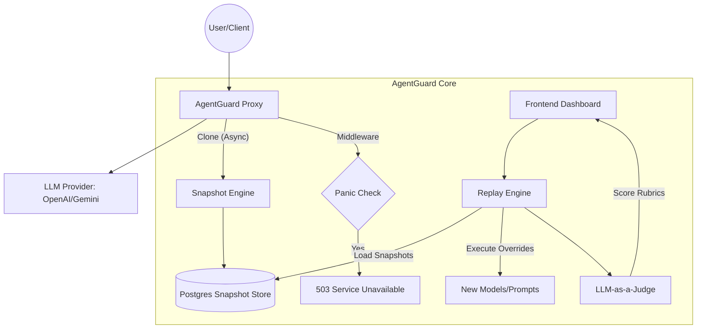

# 🛡️ AgentGuard: The AI Reliability Platform

This document serves as the master blueprint for AgentGuard, outlining the vision, architecture, and implementation phases.

## 👤 Vision
**Target**: The AI Product Engineer who fears "Silent Regressions."
**Mission**: Move AI deployment from "Vibe-testing" to "Scientific reliability." AgentGuard is the infrastructure layer (The "Vercel for Agents") that makes AI updates predictable and safe.

---

## 🏗️ High-Level Architecture

---

## 🛠️ Key Features (MVP)

### 1. Proxy (Zero-Friction Interception)
*   **Auto-Capture**: Intercept all LLM requests by simply changing the Base URL.
*   **Multi-Provider**: Full support for OpenAI, Anthropic, and Google APIs.

### 2. Snapshot/Replay
*   **Production Context**: Automatically store production traffic for testing.
*   **Regression Testing**: Re-run saved requests with new versions of models or prompts.

### 3. LLM-as-a-Judge
*   **Evaluation Rubrics**: Define custom criteria for what a "good" response looks like.
*   **Automated Scoring**: Use high-performance models (GPT-4o-mini) to score and detect regressions.

### 4. Panic Mode (Circuit Breaker)
*   **Safety Lock**: Instantly block all AI traffic (<5ms) during emergencies via a global toggle.

### 5. Projects, Auth & Organizations
*   **Multi-Tenant**: Secure project management for multiple teams.
*   **Access Control**: JWT-based authentication and organization-level permissions.

### 6. Monitoring & Analysis
*   **API Stats**: Track throughput, success rates, and latency.
*   **Quality & Drift**: Monitor quality scores and detect performance shifts over time.
*   **Cost Analysis**: Real-time tracking of LLM API expenditures.

---

## 🚀 Future Vision: Phase 4 & Beyond

### Phase 4: The Visual Control Plane (vIaC)
*   **Agent Discovery**: Automatically scan source code to map out agent architecture.
*   **Visual Orchestration**: Manage and monitor agents through an interactive "Railway-style" map.
*   **Git-Sync Integration**: Sync UI-driven prompt updates directly back to the GitHub repository.

---

## 🛡️ Coding Standards
1.  **Strict Isolation**: `project_id` must be present in every DB query.
2.  **Clean Architecture**: Controllers -> Services -> Repositories.
3.  **Non-Blocking**: Heavy operations (Snapshotting, Judging) must never block the primary AI request path.
4.  **Redis First**: Global states (Panic Mode) are checked in Redis for ultra-low latency.

---

## 💰 Strategy & Roadmap
*   **Switzerland Strategy**: Total neutrality. Migration tools to move between OpenAI, Anthropic, and Google with confidence.
*   **Moat**: Deep integration into the developer's "Vibe-to-Code" loop.
