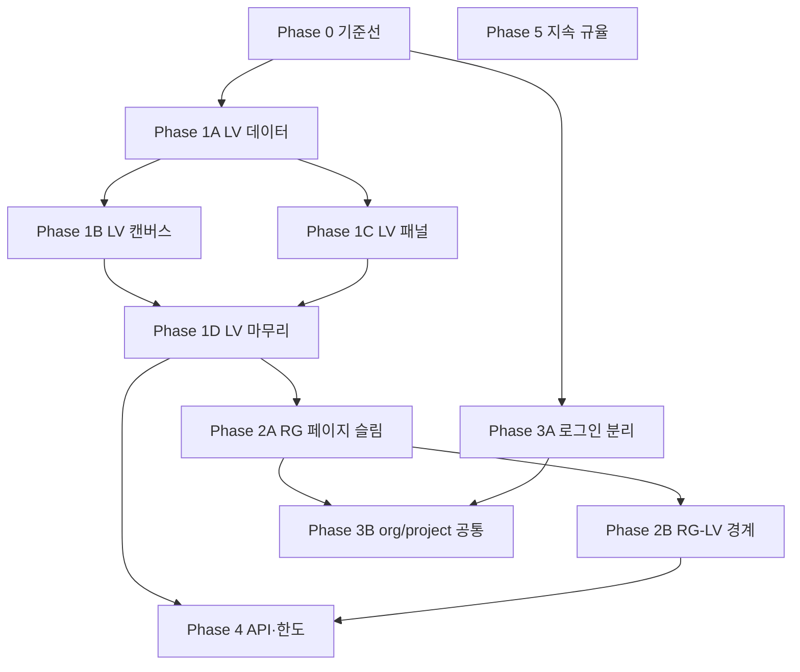

# 프론트엔드 리팩터링·구현 계획 (세분화)

**대상:** Live View, Release Gate, Organization/Project 라우트, 로그인·회원가입, 공통 API 클라이언트  
**목표:** 유지보수성·429/폴링 안정성·온보딩 변경 비용을 동시에 낮춤  
**전제:** 동작 회귀 없음(기능 동일, URL·API 계약 유지)

---

## 1. 범위·비목표

### 1.1 범위

| 영역 | 주요 경로 |
|------|-----------|
| Live View | `frontend/app/organizations/[orgId]/projects/[projectId]/live-view/page.tsx` 및 하위 컴포넌트 |
| Release Gate | `frontend/app/organizations/.../release-gate/*` (이미 부분 리팩터 완료) |
| Org/Project | `frontend/app/organizations/[orgId]/*`, `.../projects/*` |
| 인증 | `frontend/app/login/page.tsx`, `frontend/lib/api/client.ts`, BFF 세션 |
| 공통 API | `frontend/lib/api/*` |

### 1.2 비목표 (이 문서의 직접 범위 밖)

- 백엔드 스키마 변경·마이그레이션 (필요 시 별도 RFC)
- 디자인 시스템 전면 교체
- React 19 / Next major 강제 업그레이드 (호환되면 점진 적용만 언급)

---

## 2. 원칙

1. **수직 슬라이스:** 한 PR에 “한 사용자 플로우”가 깨지지 않게 유지.
2. **측정 가능한 완료:** 각 작업에 아래 **완료 정의(DoD)** 를 붙임.
3. **문서 우선:** 폴링·429 버킷·SWR 키는 코드 이동 시 **주석 또는 표**로 남김.
4. **테스트:** 리팩터 PR마다 최소 **타입체크 + 기존 Vitest + (가능하면) 스모크 E2E**.

---

## 3. 의존 관계 (요약)



---

## 4. Phase 0 — 기준선·메타데이터

**목표:** 이후 분해 작업에서 “의도 불명 상수”·“플로우 불명” 제거.

### 4.1 작업 목록

| ID | 작업 | 크기 | 완료 정의 (DoD) |
|----|------|------|-----------------|
| **0.1** | 사용자 **핵심 플로우 5개**를 이 문서 부록 A에 경로로 기술 | S | 리뷰어가 URL만 보고 재현 가능 |
| **0.2** | **429·폴링 상수 인벤토리** 표 작성 (파일 경로, 상수명, 대략적 주기) | S | [`live-view-rg-polling-inventory.md`](./live-view-rg-polling-inventory.md) |
| **0.3** | Live View·RG에 쓰이는 **SWR 키 패턴** 목록 (문자열 또는 `queryKeys`) | M | 동일 문서 §2–3 |
| **0.4** | (선택) 위 플로우 중 1개 **Playwright 스모크** | M | CI 또는 `npm run e2e` 문서화 |

### 4.2 산출물

- 부록 A 갱신
- [`live-view-rg-polling-inventory.md`](./live-view-rg-polling-inventory.md) — Phase 0.2·0.3 (폴링 상수 + SWR 키)

---

## 5. Phase 1A — Live View: 데이터·폴링·SWR

**목표:** `live-view/page.tsx`에서 **네트워크·재검증 정책**만 먼저 격리. UI는 최소 터치.

### 5.1 작업 목록

| ID | 작업 | 크기 | DoD |
|----|------|------|-----|
| **1A.1** | `LIVE_VIEW_*` 상수를 `liveViewPolling.constants.ts`(또는 동일 역할 파일)로 이동, `page`는 import | S | ✅ `live-view/liveViewPolling.constants.ts` |
| **1A.2** | SWR 인스턴스별 **`dedupingInterval` / `revalidateOnFocus`** 를 상수 파일 또는 훅 옵션 객체로 모음 | M | ✅ `liveViewSwr.defaults.ts` + project/org/agents |
| **1A.3** | 첫 번째 데이터 훅 **`useLiveViewCoreData`** (예: 프로젝트·노드·에이전트 중 2~3개만) 추출 | L | ✅ `useLiveViewCoreData.ts` (project + org + agents) |
| **1A.4** | **SSE → mutate** 디바운스 로직을 `useLiveViewSseMutate.ts` 등으로 이동 | M | ✅ `useLiveViewSseRefs` + `useLiveViewSseLifecycle` + `useLiveViewSseCloseWhenHidden` |
| **1A.5** | 401/429 분기가 훅 내부에서도 **`redirectToLogin` / `getRateLimitInfo`** 와 동일 패턴인지 점검 표 | S | ✅ `live-view-rg-polling-inventory.md` §4 |

### 5.2 리스크

- SWR 키 변경 시 캐시 미스·깜빡임 → **키 문자열 byte 동일** 유지.
- SSE 이중 구독 → **useEffect cleanup** 회귀 테스트(수동) 명시.

---

## 6. Phase 1B — Live View: React Flow·그래프

**목표:** 캔버스 전용 상태·타입과 서버 동기화 분리.

| ID | 작업 | 크기 | DoD |
|----|------|------|-----|
| **1B.1** | `ReactFlowProvider` + `NODE_TYPES`/`EDGE_TYPES` 래퍼 → `LiveViewFlowShell.tsx` | M | `page`에 JSX 블록 1개로 치환 |
| **1B.2** | **툴바** `LiveViewToolbar` props 인터페이스 문서화 (`readonly` 콜백) | S | props 타입 export |
| **1B.3** | `useNodesState`/`useEdgesState` + undo/redo → `useLiveViewGraphState.ts` | L | undo 스택 시맨틱 동일 |
| **1B.4** | API 스냅샷 → 노드/엣지 매핑 → `mapAgentsToFlowNodes.ts` 등 순수 함수 + 단위 테스트 1~2개 | L | Vitest, 엣지 케이스 1개 |

---

## 7. Phase 1C — Live View: 패널·레이아웃

**목표:** 캔버스와 사이드 패널 경계 명확화.

| ID | 작업 | 크기 | DoD |
|----|------|------|-----|
| **1C.1** | `CanvasPageLayout` + Railway + 포커스 래핑 → `LiveViewPageLayout.tsx` | M | props drilling 깊이 감소 또는 context 1곳 |
| **1C.2** | `ClinicalLog` / `AgentEvaluationPanel` / `AgentSettingsPanel` 에 넘기는 props **`LiveViewPanelProps`** 로 묶기 | M | `Pick` 또는 명시 타입 |
| **1C.3** | `AgentCardNode`에 전달하는 **Release Gate 관련 props** 목록을 표로 부록 B에 정리 | S | RG 리팩터와 중복 필드 식별 |

---

## 8. Phase 1D — Live View: 마무리·품질

| ID | 작업 | 크기 | DoD |
|----|------|------|-----|
| **1D.1** | `live-view/page.tsx` **목표 ≤350줄** (팀 합의치로 조정) | M | ESLint max-lines 경고 없음 또는 예외 주석 1회성 |
| **1D.2** | Phase 0.4 스모크 재실행 | S | 녹화 또는 체크리스트 통과 |
| **1D.3** | (선택) 폴링 지연 **순수 함수** Vitest | S | `nextDelayMs` 유사 로직 |

---

## 9. Phase 2A — Release Gate: 페이지 얇게

**전제:** 도메인 훅·`pick`·설정 패널 분리는 이미 적용됨.

| ID | 작업 | 크기 | DoD |
|----|------|------|-----|
| **2A.1** | `ReleaseGatePageContent.tsx` 목차 주석 (섹션 5~8개) | S | 신규 기여자 10분 내 구조 파악 |
| **2A.2** | Context provider 묶음 → `ReleaseGateProviders.tsx` | M | 단일 `<ReleaseGateProviders>` children |
| **2A.3** | 초기 데이터 SWR 묶음 → `useReleaseGatePageBootstrap.ts` | L | 로딩/에러 상태 동일 |
| **2A.4** | `validateRunDepsRef` + `useReleaseGateValidateRun` 연결 → `useReleaseGateValidateBridge.ts` | M | deps 동기화 한 파일 |
| **2A.5** | 맵/expanded 분기만 `ReleaseGatePageContent`에 잔류 | M | 파일 길이 20% 이상 감소 목표 |

---

## 10. Phase 2B — Release Gate ↔ Live View 경계

| ID | 작업 | 크기 | DoD |
|----|------|------|-----|
| **2B.1** | `AgentCardNode` / RG 맵 설정 객체 공통 필드 → 타입 alias 또는 `releaseGateMapConfig.types.ts` | M | 중복 `Pick` 제거 가능 |
| **2B.2** | `canRunValidate`·쿨다운·`runLocked` **상태 다이어그램** (텍스트) 부록 C | S | 지원/CS가 읽을 수 있음 |

---

## 11. Phase 3A — 로그인·회원가입 페이지

| ID | 작업 | 크기 | DoD |
|----|------|------|-----|
| **3A.1** | `LoginForm.tsx` / `RegisterForm.tsx` 분리 | M | `page.tsx`는 레이아웃+모드 |
| **3A.2** | `useLoginForm` / `useRegisterForm` (submit, error, loading) | M | `authAPI` 호출 한 곳 |
| **3A.3** | URL 쿼리 파싱 `useLoginPageQuery.ts` | S | `mode`, `next`, `reauth`, `registered` |
| **3A.4** | 확장 프로그램 콘솔 필터 → `suppressExtensionConsoleNoise.ts` | S | `page`에서 import 제거 |

---

## 12. Phase 3B — Organization / Project 공통

| ID | 작업 | 크기 | DoD |
|----|------|------|-----|
| **3B.1** | 프로젝트 하위 페이지 **403/로딩/empty** 패턴 감사 표 | M | 5페이지 이상 샘플 |
| **3B.2** | `useProjectRouteGuard` 또는 layout `loading.tsx` 정책 초안 | L | 한 라우트에 파일럿 적용 |
| **3B.3** | 파일럿 회귀 후 나머지 프로젝트 라우트 확장 | L | PR 분할 권장 |

---

## 13. Phase 4 — API 클라이언트·429 (수요 기반)

| ID | 작업 | 크기 | DoD |
|----|------|------|-----|
| **4.1** | 프로덕션 429 **버킷별 빈도** (로그/대시보드) 1주 수집 | S | 우선순위 데이터 |
| **4.2** | `client.ts`에서 **`rateLimit.ts` + `apiError.ts`** 분리 (1 PR 1 파일) | M | import 경로만 변경되는 PR 선호 |
| **4.3** | 백엔드와 **폴링 한도** 재조정 (문서: `rate-limit-heavy-endpoints-design.md` 참조) | L | 협의 후 배포 |

---

## 14. Phase 5 — 지속 규율

| ID | 작업 | DoD |
|----|------|-----|
| **5.1** | 팀 합의: 신규 파일 **소프트 상한** (예: 400줄) |
| **5.2** | 리팩터 PR 템플릿에 **스모크 5분 체크리스트** |
| **5.3** | 분기별 **부록 A 플로우** 1회 검증 |

---

## 15. 마일스톤 예시 (병렬 가능 구간 표시)

| 주차 | 집중 | 병행 |
|------|------|------|
| W1 | Phase 0 전부 | — |
| W2–W3 | 1A.1–1A.5 | 3A.1 시작 가능 |
| W4–W6 | 1B.* , 1C.* | 3A.* |
| W7 | 1D.* | 2A.1–2A.2 |
| W8–W9 | 2A.* 나머지 | 2B.* |
| W10+ | 3B.* , 4.* | 운영 데이터 보고 후 |

(팀 속도에 맞게 **±2주** 조정.)

---

## 16. 마스터 체크리스트 (복사용)

```
Phase 0
[x] 0.1 플로우 5 (부록 A)
[x] 0.2 폴링·429 표 (`docs/live-view-rg-polling-inventory.md`)
[x] 0.3 SWR 키 목록 (동일 문서)
[ ] 0.4 E2E (선택)

Phase 1A
[x] 1A.1 상수 파일
[x] 1A.2 SWR 옵션 모음
[x] 1A.3 첫 데이터 훅
[x] 1A.4 SSE mutate 훅
[x] 1A.5 에러 패턴 점검

Phase 1B
[ ] 1B.1 FlowShell
[ ] 1B.2 Toolbar props
[ ] 1B.3 Graph state 훅
[ ] 1B.4 매핑 순수함수+테스트

Phase 1C
[ ] 1C.1 PageLayout
[ ] 1C.2 Panel props 타입
[ ] 1C.3 AgentCard RG 표

Phase 1D
[ ] 1D.1 page 줄 수
[ ] 1D.2 스모크
[ ] 1D.3 Vitest (선택)

Phase 2A
[ ] 2A.1 목차
[ ] 2A.2 Providers
[ ] 2A.3 Bootstrap
[ ] 2A.4 Validate bridge
[ ] 2A.5 분기만 잔류

Phase 2B
[ ] 2B.1 공통 타입
[ ] 2B.2 상태 다이어그램

Phase 3A
[ ] 3A.1–3A.4

Phase 3B
[ ] 3B.1–3B.3

Phase 4–5
[ ] 4.1–4.3 (필요 시)
[ ] 5.1–5.3
```

---

## 부록 A — 핵심 사용자 플로우

*Phase 0.1 — 재현 시 로그인된 계정·해당 org/project 권한 필요.*

1. **로그인:** `/login` → 이메일/비밀번호 → 성공 시 `/organizations` (또는 이전 redirect).
2. **회원가입:** `/login?mode=signup` → 계정 생성 → 조직/프로젝트 온보딩 흐름(제품 설정에 따름) → `/organizations`.
3. **프로젝트 진입:** `/organizations/{orgId}/projects`에서 프로젝트 카드 선택 → `/organizations/{orgId}/projects/{projectId}` (대시보드/요약).
4. **Live View:** `/organizations/{orgId}/projects/{projectId}/live-view` → 캔버스에서 에이전트(노드) 클릭 → 우측 패널(로그/평가/데이터/설정) 탭 전환, SSE·폴링으로 목록 갱신.
5. **Release Gate:** `/organizations/{orgId}/projects/{projectId}/release-gate` → (옵션) URL `?agent_id=` 또는 맵에서 노드 선택 → Live Logs 또는 Saved Data로 baseline 선택 → 설정(모델/도구/오버라이드) → Validate 실행 → PASS/FAIL·히스토리·attempt 상세.

---

## 부록 B — AgentCardNode ↔ Release Gate (템플릿)

*Phase 1C.3 / 2B.1에서 채움.*

| Prop / 필드 | 출처 | 소비처 | 비고 |
|-------------|------|--------|------|
| … | … | … | … |

---

## 부록 C — Run 버튼 상태 (템플릿)

*Phase 2B.2에서 채움.*

- `canRunValidate`
- `runValidateCooldownUntilMs`
- `isValidating` / `activeJobId`
- `keyBlocked` / `modelOverrideInvalid`

(상태 조합 → 버튼 enabled/disabled / 메시지)

---

## 관련 문서

- [rate-limit-heavy-endpoints-design.md](./rate-limit-heavy-endpoints-design.md)
- [frontend-api-split-design.md](./frontend-api-split-design.md)
- [node-live-view-release-gate-alignment-plan.md](./node-live-view-release-gate-alignment-plan.md)
- [mvp-realtime-pipeline-implementation-plan.md](./mvp-realtime-pipeline-implementation-plan.md)

---

*문서 버전: 1.0 — 세분화 총 구현 계획 초안*
