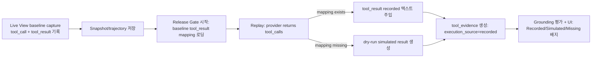

# Release Gate Tool IO Grounding Plan

> **범위**: 원래 MVP v1 관점(“simulated 폴백 + provenance”)을 유지하면서, **프로덕션 완성도**를 목표로 할 때 필요한 백엔드·프론트·SDK·보안·운영·테스트까지 한 문서에서 추적한다.

> **관련 (Live View / ingest / 프라이버시)**: [`live-view-context-privacy-plan.md`](./live-view-context-privacy-plan.md) §11–12, [`live-view-ingest-field-matrix.md`](./live-view-ingest-field-matrix.md), [`live-view-trust-data-collection.md`](./live-view-trust-data-collection.md).

### 0.1 Live View 계약·Redaction 정합 (§12.3과 연동)

- **저장/표시 모델**·ingest 스키마·SDK 마커는 [`live-view-context-privacy-plan.md`](./live-view-context-privacy-plan.md) **§11–12**를 기준으로 한다.
- **Live View** 스냅샷 상세의 `tool_timeline`은 `GET .../snapshots/{id}`에서 **`redact_secrets`** 등을 거친다.
- **Release Gate** attempt 상세의 `tool_evidence`/`tool_execution_summary`는 **replay 파이프라인이 생성**한다. 백엔드 조인이 Live View와 동일하지 않을 수 있으나, 프론트는 동일 **`ToolTimelinePanel`** / `LiveViewToolTimelineRow`로 **빈 I/O·provenance 카피**를 맞춘다 (`ReleaseGateExpandedView.tsx` 주석 참고).

## 0) 한 줄 요약

Release Gate에서 “툴 호출이 감지되었는가”를 넘어, **툴 input/output을 evidence로 전부 보여주고**, 가능한 경우 **기록된 tool_result를 replay에 주입**해서 최종 response 비교의 정확도를 올립니다.

---

## 1) 왜 필요한가 (현재 상태의 갭)

현재 구현은 다음 두 단계 성격이 섞여 있습니다.

- Stage 1(현재 UI에선 “no execution / simulated only”로 표시되는 구간)
  - 툴 호출은 감지되지만, **실행 evidence(결과 텍스트)** 는 비어 있거나 `simulated`로 취급됩니다.
- Stage 2 alpha(Replay loop에서 tool calls를 발견하면)
  - tool_result는 **결정론적 dry-run 텍스트를 “시뮬레이션”**으로 생성합니다.
  - 즉, “실제 고객 환경에서 툴이 반환한 결과”와 일치하지 않을 수 있습니다.

그 결과, 툴 의존 에이전트(예: 날씨/DB 조회/검색 기반)에서 다음이 약해집니다.

- “기록된 baseline에서 얻은 툴 결과”를 근거로 candidate response를 비교해야 하는데, replay 과정에서 tool_result가 simulated로 대체됩니다.
- 사용자는 UI에서 tool evidence를 보지만, “real 실행인지 / dry-run인지 / 기록이 없는지”를 **표준화된 의미로 해석하기 어렵습니다.**

---

## 2) 목표 / 비목표

### 목표 (MVP v1)

1. UI에서 툴 evidence를 “보여주는 것”을 넘어, **근거의 출처(provenance)** 를 명확히 표준화합니다.
2. baseline(기록된) run에 **tool_result가 존재하는 경우**에는 replay에서 simulated tool_result 대신 **기록된 tool_result 텍스트를 주입**합니다.
3. tool_result가 없거나(기록 누락) 신뢰하기 어려운 경우에는 simulated로 폴백하되, UI와 Gate 판정에서 **근거 불확실성을 드러냅니다.**

### 비목표 (초기)

- “임의의 외부 툴을 실제로 실행”하는 형태의 임의 툴 실행(E2E tool runner 구현)은 초기 범위를 넘어섭니다.
- side-effect(결제/삭제/메일 발송 등) 툴을 재실행하는 정책/권한/감사는 MVP v1에서 다루지 않습니다.

### 완성도 트랙에서 추가로 다루는 것 (이 문서 하단 §11~)

- **관측 가능한 tool_result / action 이벤트**를 ingest·저장·조회·UI까지 일관되게 연결한다.
- **record-and-replay**: Release Gate는 기본적으로 recorded tool_result를 우선 주입하고, 없을 때만 simulated/missing을 명시한다.
- **보안·리텐션·RBAC·Export**까지 포함해 “보여줄 수 있는 데이터”와 “저장해도 되는 데이터”를 분리한다.

---

## 3) Evidence 정의 (표준 스키마 제안)

현재 UI는 `tool_evidence[]`와 `tool_execution_summary`를 기반으로 “tool integrity / grounding”과 “Gate confidence”를 계산합니다.

이 문서는 여기에 아래 필드를 **선택(optional)으로 추가**하는 방향을 제안합니다. (기존 필드를 깨지 않음)

- `tool_evidence[]`(각 row)
  - 기존(이미 존재): `name`, `status`, `arguments_preview`, `result_preview`, (필요 시) `round`, `mode`
  - 신규(옵션):
    - `execution_source`: `"recorded"` | `"simulated"` | `"missing"`
      - recorded: baseline에 실제 tool_result가 있고 replay 주입에 사용됨
      - simulated: dry-run 텍스트(현재 Stage 2 alpha 성격)로 대체됨
      - missing: baseline/기록에서 tool_result를 찾지 못해 결과가 비어 있거나 폴백 실패
    - `tool_result_source`: `"baseline_snapshot"` | `"trajectory_steps"` | `"dry_run"`
      - recorded일 때만 값 의미를 가짐
    - `call_id`: (가능하면) tool_call id. 같은 call에 대한 call->result 매칭을 쉽게 디버깅

- `tool_execution_summary.counts`(요약)
  - 기존: `total_calls`, `executed`, `simulated`, `skipped`, `failed`, `tool_results`
  - 제안:
    - `executed`는 “recorded tool_result로 주입되어 grounded 가능”한 경우에만 증가하도록 의미를 고정
    - simulated는 dry-run일 때만 증가

---

## 4) 기대 UX (사용자 관점 화면 규칙)

Release Gate Expanded View의 tool section에서 항상 아래 3개를 보여줍니다.

1. “툴 호출 수 vs 툴 결과 수”
2. “결과 근거 출처” 배지 3종
   - `Recorded`(기록 주입) / `Simulated`(dry-run) / `Missing`(기록 없음)
3. “최종 response 근거(grounding) 신뢰도”
   - tool_result가 recorded로 충분히 매칭되면 confidence를 High
   - recorded가 비거나 missing/simulated만 있으면 confidence를 Low

사용자는 “툴을 실행했는지”보다 “**비교를 지지하는 evidence가 실제로 존재하는지**”를 판단할 수 있어야 합니다.

---

## 5) 구현 전략 (Phased plan)

### Phase 1 (UI 표준화: evidence 출처 배지 + 툴 row 의미 고정)

- 목표: 현재 UI가 보여주는 tool evidence를, 사용자가 오해하지 않도록 “의미”를 문서화하고 배지를 표준화
- 변경 범위(예상):
  - `ReleaseGateExpandedView.tsx`: tool evidence table에 `execution_source` 배지를 표시(옵션 필드가 없을 경우 기존 값으로 추론)
  - 실패/경고 문구에 “Stage 1 simulated only” 대신 “Recorded/Simulated/Missing” 기준을 먼저 노출

완료 기준:
- 사용자가 tool 결과가 dry-run인지 recorded인지 한눈에 구분 가능

### Phase 2 (Backend: baseline tool_result를 replay에 주입)

- 목표: baseline에 tool_result가 있으면 simulated dry-run을 대체합니다.

#### 2.1 baseline에서 tool_result 텍스트 확보

필요한 매핑은 다음 형태입니다.

- `tool_call_id -> tool_result_text_preview`

현재 DB에는 정규화 step 저장소로 `trajectory_steps.tool_result`가 존재합니다.
따라서 replay 이전에 baseline run(또는 trace)의 trajectory steps에서 tool_call과 tool_result를 매칭할 수 있어야 합니다.

#### 2.2 replay_service의 Stage 2 alpha에서 “simulated 생성” 분기 변경

기존:

- provider가 tool_calls를 반환하면, replay_service가 `_build_simulated_tool_result_text()`로 dry-run result를 만들고 conversation에 넣음

변경:

- baseline tool_result 매핑이 존재하면, 해당 call의 result_preview를 recorded 텍스트로 사용
- 매핑이 없으면 기존과 동일하게 simulated를 생성하되 evidence row에 `execution_source=missing|simulated`를 명시

#### 2.3 gate evidence 생성(grounding 판단 입력) 정합화

- recorded로 주입된 tool_result는 `tool_evidence.status` 및 summary의 `executed` count 기준을 만족시켜야 합니다.
- grounded ratio(coverage)가 recorded evidence를 기준으로 계산되도록, backend가 tool evidence row을 일관된 shape으로 내보냅니다.

완료 기준:
- baseline에 tool_result가 있는 케이스에서 Gate 결과의 tool evidence가 simulated가 아니라 recorded로 표시됨
- “tool call 감지는 되는데 tool 결과가 비어있는” 케이스가 감소해야 함

### Phase 3 (옵션: read-only tool 재실행(미래))

미래 확장 시나리오:

- 사용자가 특정 tool을 “replay에서도 실제 재실행 허용(읽기 전용)””으로 표시
- replay에서 동일 tool을 실행하고 결과를 기록
- 하지만 side-effect 툴은 기본 deny, 실행 권한/감사/재현성 규칙이 추가로 필요

이 문서 v1에서는 설계 방향만 고정합니다.

---

## 6) 구현 흐름 다이어그램

---

## 7) 수용 기준 (Acceptance Criteria)

1. Recorded 주입 케이스
   - baseline run에 tool_result가 존재
   - Release Gate 실행 후 UI tool evidence에서 해당 tool row의 `execution_source=recorded`가 표시
   - grounding coverage가 recorded evidence 기준으로 계산됨
2. Missing/폴백 케이스
   - baseline run에 tool_result가 누락
   - UI는 `execution_source=missing` 또는 `simulated`로 표시
   - gateConfidence(또는 툴 무결성 신뢰도)는 Low로 내려갈 수 있어야 함
3. 기존 동작 호환
   - `execution_source` 필드가 백엔드에서 아직 제공되지 않아도 UI는 기존 `status`/counts 기반으로 최소 동작해야 함

---

## 8) 테스트 계획(간단)

- Unit(백엔드)
  - tool mapping이 있을 때 simulated로 생성하지 않는 분기
  - missing 매핑 시 evidence가 missing/simulated으로 일관되게 생성되는지
- UI(프론트)
  - 배지 표시 로직: recorded/simulated/missing을 기존 status로도 추론 가능한지
- Manual
  - deterministic read-only tool(예: 고정 응답 weather/검색 토이)을 baseline에서 tool_result로 저장한 뒤 Gate에서 grounding이 개선되는지 확인

---

## 9) 다음 작업(문서에서 “계획 → 구현”으로 옮길 때의 체크리스트)

- [x] backend: baseline run에서 `tool_call_id -> tool_result_text_preview` 매핑 로딩 로직 추가
- [x] backend: replay_service Stage 2 alpha에서 simulated tool_result 생성 분기 수정
- [x] backend: tool evidence row에 `execution_source/tool_result_source` 추가
- [x] frontend: tool evidence table에 provenance 배지 추가
- [x] docs: `mvp-node-gate-spec.md` tool stance 섹션 문구 업데이트(본 계획과 충돌 제거)

---

## 10) Commit-level 구현 계획 (코드 기준, 따라 할 레일)

이 섹션은 “어디를 고치면 실제로 목표에 도달하는지”를 **커밋 단위**로 쪼개서 적습니다.
문서의 Phase 1/2/3를 그대로 구현하되, 현재 코드의 데이터 경로(ingest → snapshot detail → release gate replay)를 기준으로 순서를 잡습니다.

### 10.0 현재 코드의 데이터 경로(현실 체크)

> **2026-03 갱신**: 아래는 저장소 기준 동작 요약이다. 세부 감사는 §18.1 참고.

- **스냅샷 상세(로그 상세) 데이터 소스**
  - API: `GET /api/v1/projects/{project_id}/snapshots/{snapshot_id}`
  - Backend: `backend/app/api/v1/endpoints/live_view.py:get_snapshot` — 응답에 `tool_timeline[]`, `tool_timeline_redaction_version` 포함. `trajectory_steps`가 있으면 우선, 없으면 `payload.tool_events`에서 구성(`_tool_timeline_for_snapshot`).
  - Frontend: `frontend/components/shared/SnapshotDetailModal.tsx` — `ToolTimelinePanel`로 타임라인 표시.
  - `tool_calls_summary`는 리스트/배지용 경량 요약으로 병행 유지.

- **SDK ingest 경로(프로덕션 실시간 로그)**
  - API: `POST /api/v1/projects/{project_id}/api-calls` — 본문에 선택 필드 `tool_events` (`APICallIngestBody`, 상한·정규화는 `app.utils.tool_events`).
  - Snapshot payload: `background_tasks._save_api_call_sync` 등에서 `request`/`response`와 함께 정규화된 `tool_events`를 `payload_for_snapshot`에 병합.

- **Release Gate replay(tool_result 주입)**
  - Backend: `backend/app/services/replay_service.py` — Stage 2 tool loop에서 스냅샷의 recorded tool_result(`call_id` 또는 이름 큐)를 우선 사용, 없으면 `_build_simulated_tool_result_text()` 폴백; evidence 행에 `execution_source` 등 설정.
  - Gate 응답 정규화: `release_gate.py`에서 `execution_source` / `tool_result_source` 유지.

이 계획의 목표는 “툴을 재실행”이 아니라:
1) 프로덕션에서 실제 실행된 tool IO를 **우리 트레이스(trajectory_steps)로 저장**하고,
2) Release Gate replay가 tool_calls를 만났을 때, **기록된 tool_result를 우선 주입**하는 것입니다.

---

### Commit A1 — Tool IO를 ingest payload로 받기(최소 계약)

**목표**: 고객 서비스에서 “툴 호출 input”과 “툴 결과 output”을 우리에게 보내면, 스냅샷/트레이스에 남길 수 있는 길을 만든다.

- 변경(백엔드)
  - `backend/app/api/v1/endpoints/api_calls.py`
    - `APICallIngestBody`에 선택 필드 추가(예: `tool_events?: list`)
  - `backend/app/services/background_tasks.py`
    - `payload_for_snapshot`에 `tool_events`를 포함(그리고 tool_calls_summary 계산은 기존대로 유지)

- 최소 스키마(제안)
  - `tool_events[]` row:
    - `kind`: `"tool_call"` | `"tool_result"` | `"action"`(side-effect, future)
    - `name`: tool/action name
    - `call_id`: string (있으면 매칭이 쉬움)
    - `input`: object | string (tool_call)
    - `output`: object | string (tool_result)
    - `status`: `"ok" | "error" | "skipped"` (tool_result/action)
    - `ts_ms`: number (optional; 없으면 snapshot created_at로 정렬)

**완료 기준**
- ingest 요청에 `tool_events`를 포함해도 202 Accepted로 정상 ingest 되고,
- `GET /snapshots/{id}`에서 payload 안에 `tool_events`가 보인다(보안 마스킹 정책은 별도 커밋에서 강화).

---

### Commit A2 — tool_events → trajectory_steps로 정규화 저장

**목표**: Live View / Release Gate가 공통으로 소비 가능한 “tool timeline”을 DB의 `trajectory_steps`에 만든다.

- 변경(백엔드)
  - `backend/app/api/v1/endpoints/behavior.py`
    - `_build_trace_steps()`가 현재 `response_to_canonical_steps(s.payload, ...)`만 사용함
    - 여기에 `payload.tool_events`(있을 때)를 읽어 `step_type=tool_call/tool_result/action` step을 추가하는 빌더를 붙인다.
  - `backend/app/models/trajectory_step.py`는 이미 `tool_result` JSON 컬럼이 있어 추가 컬럼 없이 MVP 가능.

**디자인 노트**
- “tool_call_id 매칭”은 처음엔 완벽하지 않아도 되지만, `call_id`가 있으면 반드시 `tool_args`/`tool_result`에 보존한다.
- step_order는 `span_order`를 base로, tool_events는 `+0.001` 같은 소수로 안정 정렬한다(Release Gate가 이미 소수 step_order 관례를 사용).

**완료 기준**
- 같은 snapshot의 payload에 `tool_events`가 있으면,
- behavior validation을 한 번 돌렸을 때(자동/수동) `trajectory_steps`에 tool_call/tool_result rows가 저장된다.

---

### Commit A3 — 스냅샷 상세 API에 tool timeline(=tool_events 정규화 결과) 노출

**목표**: 사용자가 “로그 상세 맨 아래”에서 tool output(가져온 정보)과 side-effect(보낸 내용)를 읽을 수 있게 한다.

- 변경(백엔드)
  - `backend/app/api/v1/endpoints/live_view.py:get_snapshot`
    - 응답에 `tool_timeline[]` 추가
    - 소스: `trajectory_steps`에서 `project_id + trace_id + source_id(snapshot.id)`로 조회(또는 trace_id 전체, MVP 선택)

- 변경(프론트)
  - `frontend/components/shared/SnapshotDetailModal.tsx`
    - 기존 `Tool calls` 섹션 아래에 `Tool results`(그리고 future: `Actions`) 섹션 추가
    - row에 provenance 배지: recorded(ingest) vs simulated(replay) vs missing

**완료 기준**
- 스냅샷 상세에서 “어떤 툴을 썼는지” 뿐 아니라, “툴이 반환한 결과 요약”이 함께 보인다.

---

### Commit B1 — canonical step layer에 tool_call_id 보존(Release Gate 매칭 기반)

**목표**: recorded tool_result를 replay tool_call과 매칭할 수 있도록 최소 식별자(call_id)를 canonical step에 보존한다.

- 변경(백엔드)
  - `backend/app/core/canonical.py:response_to_canonical_steps`
    - tool_call step에 `tool_args` 내부(예: `_call_id`)로 `tc.id`를 복사(있을 때)
    - (후속 커밋) trajectory_steps 저장 시에도 동일하게 남도록 유지

**완료 기준**
- OpenAI/Anthropic/Google 중 call id가 존재하는 케이스에서, canonical steps에 call_id가 노출된다.

---

### Commit B2 — Release Gate replay에서 recorded tool_result를 우선 주입

**목표**: replay loop가 tool_calls를 감지했을 때, simulated이 아니라 baseline recorded 결과를 “컨텍스트”로 넣어 response를 생성한다.

- 변경(백엔드)
  - `backend/app/services/replay_service.py`
    - Stage 2 alpha tool loop에서 `simulated_result` 생성 전에 `recorded_result_map` 조회
    - recorded가 있으면 `tool_result_text_by_id[call_id]=recorded_text`
    - 없으면 기존 simulated 폴백
  - `backend/app/api/v1/endpoints/release_gate.py`
    - `tool_evidence` row에 `execution_source`(recorded/simulated/missing)와 `tool_result_source`를 채워 UI가 오해 없이 표시하도록 한다.

**완료 기준**
- baseline에 recorded tool_result가 있는 케이스에서, Release Gate attempt의 tool evidence가 simulated가 아니라 recorded로 표시되고,
- tool grounding coverage가 개선된다(최소 1개 케이스에서 정량 확인).

---

### Commit B3 — UI: Release Gate attempt 상세/로그 상세에서 동일한 “툴 타임라인” 경험

**목표**: 사용자가 Live View에서 보던 tool IO와 Release Gate에서 보던 tool IO가 같은 규칙/표현으로 보이게 한다.

- 변경(프론트)
  - `frontend/app/.../release-gate/ReleaseGateExpandedView.tsx`
    - tool evidence table에 `Recorded/Simulated/Missing` 배지를 표준 표시
    - “Stage 1 simulated only” 같은 문구는 provenance 중심으로 교체
  - `SnapshotDetailModal`과 시각 컴포넌트(행 렌더러)를 공유할지 결정(공유하면 유지보수 비용 감소).

**완료 기준**
- 같은 trace를 기준으로 Live View 상세와 Release Gate attempt 상세에서 tool row 표현이 일관된다.

---

### Commit C1 (선택) — side-effect(Action) 이벤트(메일/슬랙/HTTP 등) 표준화 ✅

**목표**: “에이전트가 사용자 코드로 밖에 보낸 내용”을 tool_result와 분리된 `action` 이벤트로 저장/표시한다.

- 변경(백엔드)
  - Commit A1의 `tool_events.kind="action"`을 공식 지원
  - 저장은 동일하게 `trajectory_steps.step_type="action"`으로 기록(또는 `tool_result.tool_kind="action"`으로 통일)

**완료 기준**
- 로그 상세에서 “툴로 가져온 정보”와 “밖으로 보낸 payload”가 구분되어 표시된다.

**상태 (2026-03)**: ingest·behavior·live_view 경로에서 `action` kind / `step_type="action"`이 처리되고, `ToolTimelinePanel`에서 action 행은 왼쪽 강조·타입 라벨로 구분된다. 스키마 SoT는 `docs/TOOL_EVENTS_SCHEMA.md`.

---

## 11) 완성도 트랙 — 백엔드 (상세 체크리스트)

### 11.1 단일 진실 원천(SoT)과 저장 계층

| 계층 | 역할 | 비고 |
|------|------|------|
| `snapshots.payload` | 원본 보존(디버깅·재현·provider별 raw) | 이미 존재. tool_events를 여기에 넣으면 과거 스냅샷과 호환 가능 |
| `snapshots.tool_calls_summary` | 리스트/배지용 경량 요약 | 기존 유지; tool_events와 중복 시 **요약은 파생**으로 맞출지 정책 결정 |
| `trajectory_steps` | 쿼리·Gate·Behavior rules용 **정규화 타임라인** | `tool_result` JSON 컬럼 활용. Live View / Gate 공통 소비 |

**권장**: UI·Gate는 가능하면 `trajectory_steps`(또는 이를 API로 노출한 `tool_timeline`)를 우선 소비하고, raw payload는 “Advanced / Raw JSON”로만 노출.

### 11.2 Ingest 계약 확장 (`POST .../api-calls`)

- **파일**: `backend/app/api/v1/endpoints/api_calls.py` (`APICallIngestBody`), `backend/app/services/background_tasks.py` (`save_api_call_async`)
- **작업**
  - 선택 필드 `tool_events[]` (및 필요 시 `actions[]` 별도) 스키마를 Pydantic으로 검증
  - `payload_for_snapshot`에 `tool_events` 병합 (현재 `{request, response}` 구조 유지 + 확장 키)
  - Redis 큐 경로(`ingest_api_call` → lpush)에도 동일 payload 필드가 포함되는지 확인
- **검증 규칙(권장)**
  - 최대 이벤트 개수(예: 50), 단일 필드 최대 바이트(예: 64KB), 전체 payload 상한
  - `call_id` 형식(비어 있음 허용 vs 필수) — provider별로 다를 수 있어 **optional + 경고 로그**

### 11.3 스냅샷 저장 경로 통일 (`SnapshotService` vs SDK 백그라운드)

- **파일**: `backend/app/services/snapshot_service.py`, `backend/app/services/stream_processor.py`, `backend/app/services/background_tasks.py`
- **작업**
  - Proxy/직접 저장/SDK 저장 **모든 경로**에서 동일한 `payload` shape과 `tool_events` 처리 규칙 적용
  - `extract_tool_calls_summary`만으로는 tool_result가 안 나오므로, **요약은 tool_events에서 파생**하는 헬퍼 추가 검토

### 11.4 Trace steps 빌드 (`behavior._build_trace_steps`)

- **파일**: `backend/app/api/v1/endpoints/behavior.py`
- **작업**
  - `payload.tool_events` → canonical step 리스트에 merge
  - 기존 `response_to_canonical_steps(s.payload["response"], ...)`와 **순서·중복** 정책 문서화
    - 예: 같은 `call_id`에 대해 tool_call 후 tool_result가 오도록 정렬; `ts_ms` 없으면 배열 순서 고정
  - `run_behavior_validation_for_trace` 호출 시점에 trajectory persist가 항상 돌게 할지(스냅샷 저장 직후 자동 vs lazy) 결정

### 11.5 Canonical layer 보강 (`canonical.py`)

- **파일**: `backend/app/core/canonical.py`
- **작업**
  - `response_to_canonical_steps`에 **tool_result step** 추가(Anthropic `content[].tool_result`, OpenAI follow-up messages의 `role=tool` 등)
  - tool_call step에 **`_call_id` 또는 명시 필드**로 id 보존 (정책 엔진/매칭에 필요)
  - `response_to_canonical_tool_calls`와 중복 추출 방지(한 응답에서 call/result가 같이 있을 때)

### 11.6 Live View API (`live_view.py`)

- **파일**: `backend/app/api/v1/endpoints/live_view.py`
- **작업**
  - `get_snapshot`: `tool_timeline[]` (또는 `tool_events_resolved[]`) 추가 — `trajectory_steps` 조회 + 스냅샷 단위 필터(`source_id == snapshot.id` 권장)
  - `list_snapshots(light=true)`: 무거운 필드 제외 유지. 필요 시 `has_tool_results: bool` 같은 **불린만** 추가
- **마스킹**: §14와 연동 — API 응답 단계에서 redaction 적용 여부 결정

### 11.7 Release Gate + Replay (`release_gate.py`, `replay_service.py`)

- **매핑 로더**: baseline `trace_id` + `snapshot_id`(케이스) 기준으로 `recorded_result_map` 구축
- **replay_service**: tool loop에서 `recorded` 우선 → 없으면 `_build_simulated_tool_result_text`
- **release_gate**: `tool_evidence[]`에 `execution_source`, `tool_result_source`, `call_id`, (선택) `matched_baseline_call_id` 기록
- **cross-provider**: baseline OpenAI / replay Anthropic 등에서 **call_id 불일치** 시 heuristic(이름+순서) 폴백 + UI에 “weak match” 표시

### 11.8 DB·마이그레이션

- **우선**: `trajectory_steps` 컬럼 추가 없이 진행 가능한지 재검토
- **필요 시** (완성도 상향 시):
  - `trajectory_steps`에 `event_kind`, `call_id`, `redaction_version` 등 인덱스용 컬럼
  - `(project_id, trace_id, source_id)` 복합 인덱스로 상세 조회 최적화 — **구현됨**: Alembic `20260321_traj_pr_tr_src`, 인덱스명 `ix_trajectory_steps_project_trace_source`

### 11.9 관측·로깅·에러 처리

- structured log: ingest에서 tool_events drop 사유(크기/스키마/개수)
- metrics: recorded vs simulated 비율, missing 비율(프로젝트별)

---

## 12) 완성도 트랙 — 프론트엔드 (상세 체크리스트)

### 12.1 공통: Tool Timeline UI 컴포넌트

- **신규(권장)**: `frontend/components/tool-timeline/ToolTimelinePanel.tsx` (이름 예시)
  - 입력: `rows[]` 통일 스키마 (`kind`, `name`, `call_id`, `input_preview`, `output_preview`, `execution_source`, `status`, `ts`)
  - 동작: 접기/펼치기, “Copy redacted”, “Show raw”(권한 있을 때만)
- **소비처**
  - `SnapshotDetailModal.tsx` — 기존 “Tool calls” 아래 **Tool results / Actions** 탭 또는 섹션
  - `ReleaseGateExpandedView.tsx` — attempt 상세의 tool evidence와 **동일 컴포넌트** 재사용
  - `ReleaseGatePageContent.tsx` / 설정 패널 — **선택된 baseline 스냅샷의 tool timeline 읽기 전용** 삽입

### 12.2 타입·API 클라이언트

- **파일**: `frontend/lib/api/live-view.ts`, (필요 시) `frontend/lib/api/types.ts`
- `getSnapshot` 응답 타입에 `tool_timeline?: ...` 반영
- Release Gate 응답 타입에 `tool_evidence[].execution_source?` 등 optional 필드 반영

### 12.3 Release Gate “설정 화면에서 툴 내용 다 보이기”

- **원칙**: candidate JSON은 **config-only** 유지. tool **실행 결과**는 스냅샷/타임라인에서만 표시 (스펙과 충돌 방지)
- **UI 배치**
  - 중앙 패널: tools 정의 + sampling (기존)
  - 우측/하단: “Baseline tool activity (read-only)” — 선택된 `snapshot_ids` 중 대표 1건 또는 집계
- **empty state**: tool_events 없으면 “No tool I/O captured for this snapshot. Instrument your app or upgrade SDK.”

### 12.4 접근성·카피

- 배지 라벨은 **영어 고정** (기존 제품 규칙과 정합)
- `aria-label`에 provenance 포함 (스크린리더가 simulated를 반드시 읽게)

### 12.5 성능

- 대용량 tool output은 기본 접힘 + 첫 N줄만 렌더; 전체는 lazy load 또는 modal

---

## 13) SDK·연동 (Python / Node / 기타)

### 13.1 최소 API

- `POST /api/v1/projects/{project_id}/api-calls` body에 `tool_events` 추가
- 문서: `sdk/python/README.md`, `sdk/node/README.md`, (선택) `docs/manual-test-scenarios-mvp-replay-test.md` INT 섹션 보강

### 13.2 클라이언트 헬퍼 (권장)

- `logToolCall({ name, callId, input })` / `logToolResult({ name, callId, output, status })` / `logAction({ type, destination, payloadPreview, status })`
- OpenAI/Anthropic 래퍼에서 **provider tool_call id**를 그대로 전달하도록 예제 제공

### 13.3 하위 호환

- `tool_events` 없는 구버전 SDK는 기존과 동일 동작
- 서버는 필드 부재 시 missing/simulated UI만 강화 (이미 AC에 있음)

---

## 14) 보안·프라이버시·컴플라이언스

### 14.1 데이터 분류

- **tool_result / action output**은 PII·시크릿·영업비밀 가능성 높음 → 기본은 **redacted preview 저장**, full은 opt-in 또는 role-gated

### 14.2 Redaction 파이프라인

- ingest 직후 또는 persist 직전에 적용 (한 곳에서만)
- 규칙 예: 이메일/전화/API key 패턴 마스킹, JWT 제거, credit card heuristic
- `redaction_version`을 metadata에 남겨 재처리 가능하게

### 14.3 RBAC·Export

- Export/Copy JSON에 raw tool_result 포함 여부를 역할별로 제한
- Release Gate history export에도 동일 정책 적용

### 14.4 감사

- side-effect action은 **who/when/project/snapshot** 메타와 함께 저장 (재판단·사고 대응)

---

## 15) 성능·운영·비용

### 15.1 DB

- `trajectory_steps` bulk insert 경로 확인 (`behavior._persist_trajectory_steps`)
- trace당 step 폭증 시 purge/rollup 정책(Enterprise에서만 full raw 보관 등)

### 15.2 API

- `get_snapshot`에 timeline 붙일 때 N+1 방지 — 한 쿼리로 `source_id` 필터

### 15.3 Replay 비용

- recorded 주입이 늘면 모델이 더 긴 컨텍스트를 받을 수 있음 → 토큰/credits 영향 문서화

**정리 (고객·내부 공통)**

- Release Gate replay는 baseline 대비 **추가 라운드**(tool loop)에서 모델에 `tool_result` 메시지를 넣습니다. baseline에 **recorded** `tool_result` 텍스트가 길수록, 해당 라운드의 **프롬프트 토큰**이 그만큼 늘어납니다(시뮬레이션만 쓸 때보다 상한이 높아질 수 있음).
- **Billing / credits**: 과금 단위가 “요청 1회”가 아니라 **토큰·입력 길이**에 연동되어 있다면, 동일 trace에 대해 tool 라운드가 많거나 recorded 결과가 클수록 **비용이 증가**할 수 있습니다. Self-hosted/고정 요금제는 영향이 다를 수 있음.
- **완화**: SDK/ingest에서 `tool_events`의 output은 **preview 길이**를 맞추고(서버도 상한 적용), 불필요하게 큰 JSON을 넣지 않는 것이 좋습니다. Live View/API는 이미 redacted timeline을 노출합니다.
- **운영 지표**: `missing` 비율이 높으면 시뮬레이션 폴백 비중이 커지고, recorded가 많으면 위 토큰 효과가 커집니다. 둘 다 대시보드/알림(§15.4)과 함께 보면 됩니다.

### 15.4 모니터링

- 알림: “missing tool_result 비율 급증” = 고객 계측 누락 또는 provider 포맷 변경 신호

**구현**

- `ops_alerting.observe_release_gate_tool_missing_surge`: `case_results[].attempts[].tool_evidence`에서 `execution_source=missing` 비율을 프로젝트별 롤링 윈도우로 평균 내고, 임계값 초과 시 웹훅 알림(환경변수 `OPS_ALERT_WEBHOOK_URL` 등 기존 OPS 경로와 동일).
- 설정: `OPS_RG_TOOL_MISSING_WINDOW_SECONDS`(기본 3600), `OPS_RG_TOOL_MISSING_MIN_SAMPLES`(기본 5), `OPS_RG_TOOL_MISSING_RATIO_THRESHOLD`(기본 0.72).
- 동기 validate / webhook / async job runner 모두 완료 시점에 `release_gate_tool_evidence_snapshot` 구조화 로그.
- **Admin dry-run**: `POST /api/v1/admin/ops-alerts/test`에 `event_type: "release_gate_tool_missing_surge"`(선택 `evidence_rows`, `missing_rows`, `repeats`). 실제 알림 경로를 켜려면 `repeats`를 최소 샘플 수 이상으로 두는 것이 좋다.

---

## 16) 테스트 전략 (완성도)

### 16.1 Unit (backend)

- `canonical.py`: OpenAI/Anthropic/Google 샘플 payload에서 tool_call + tool_result step 추출
- 매핑: `call_id` 일치 / 불일치 heuristic / 완전 missing
- `replay_service`: recorded 주입 시 simulated 문자열이 **대화에 들어가지 않음**

### 16.2 Integration

- ingest with `tool_events` → DB snapshot payload → behavior validate → trajectory_steps 존재
- `GET /snapshots/{id}`에 `tool_timeline` 포함

### 16.3 E2E (Playwright)

- fixture 프로젝트로 스냅샷 1건 생성(또는 seed) → Live View 상세에서 Tool results 섹션 표시
- Release Gate run 1회 → attempt 상세에 provenance 배지

### 16.4 회귀 방지

- 기존 스냅샷( tool_events 없음 ): UI 깨지지 않음, Gate 기존 simulated 경로 유지

---

## 17) 문서·온보딩·릴리즈 노트

- 이 문서 + `docs/mvp-node-gate-spec.md` + `docs/TOOL_EVENTS_SCHEMA.md`에 **동일한 JSON 예시**를 복붙 가능하게 유지
- 고객-facing: `docs/why-send-tool-results.md` (Gate 정확도 / 근거 요약)
- Breaking change가 있으면 SDK major 버전과 함께 릴리즈 노트에 명시

---

## 18) Definition of Done (종합)

다음을 모두 만족하면 “완성도 트랙 1차 완료”로 본다.

1. **Ingest**: `tool_events`가 검증·저장되고, 스냅샷 payload에서 조회 가능하다.
2. **Normalize**: 동일 trace에 대해 `trajectory_steps`에 tool_call/tool_result/action이 시간순으로 재구성 가능하다.
3. **Live View**: 스냅샷 상세에서 tool output/action이 **provenance와 함께** 보인다.
4. **Release Gate**: replay가 recorded tool_result를 우선 주입하고, evidence에 execution_source가 일관된다.
5. **호환**: 필드가 없는 구버전 데이터에서도 UI/API가 안전하게 degrade된다.
6. **보안**: 기본 redaction + export 제한이 적용된다.
7. **테스트**: unit + integration + 최소 E2E로 위 6항이 자동 검증된다.

> **현실적 범위**: 핵심 경로는 unit/integration + `frontend/tests` Playwright 스모크(공개 라우트·로그인 없이 가능한 수준)로 커버합니다. 전체 플로우를 실데이터로 E2E하려면 인증·시드 프로젝트가 필요합니다.

### 18.1 레포 감사 (2026-03-26, Definition of Done 대조)

코드 검색·주요 경로 확인으로 §18 항목을 다음과 같이 표시한다. **완료**는 “핵심 구현 + 자동 테스트가 있거나 명확히 연결됨”, **부분**은 “구현은 있으나 문서 §14 전역 RBAC/export 매트릭스까지는 미검증” 등.

| §18 | 상태 | 근거(대표 경로) |
|-----|------|------------------|
| 1 Ingest `tool_events` | **완료** | `api_calls.py` 필드 + `normalize_tool_events`; `background_tasks.py` payload 병합; `test_tool_events_live_view_pipeline.py` |
| 2 `trajectory_steps` 정규화 | **완료** | `behavior.py` `_steps_from_payload_tool_events` + `_persist_trajectory_steps`; 동일 통합 테스트 |
| 3 Live View 타임라인 | **완료** | `live_view.py` `tool_timeline`; `SnapshotDetailModal` + `ToolTimelinePanel` |
| 4 RG recorded 우선 주입 | **완료** | `replay_service.py` recorded / simulated 분기; `release_gate.py` evidence 필드 |
| 5 구버전 degrade | **완료** | 통합 테스트 `test_snapshot_detail_safely_degrades_when_tool_events_are_absent` |
| 6 보안 redaction / export | **부분** | API 단계 `redact_secrets`·`TOOL_TIMELINE_REDACTION_VERSION` 적용. §14.3 **역할별 raw export 제한**은 엔드포인트별로 별도 체크리스트 권장 |
| 7 테스트 | **부분** | Backend: `test_replay_service_tool_followup.py`, `test_tool_events_live_view_pipeline.py`, `test_ops_alerting_service.py` 등. Frontend: `snapshot-detail-tool-io.spec.ts` 등. **전 구간 단일 E2E(인증+실데이터)** 는 여전히 선택 과제 |

**권장 후속 (우선순위 낮음~중)**

1. **§18.6 마감**: Export/Copy JSON·Release Gate history export에서 raw `tool_result` 노출을 역할과 대조해 문서화·테스트.
2. **프록시/스트림 전용 저장 경로**: SDK ingest 외에 스냅샷이 들어오는 모든 진입점에서 `payload`에 `tool_events`가 동일 규칙으로 유지되는지 정기 점검(§11.3).
3. **§15.4 운영**: `observe_release_gate_tool_missing_surge`가 스테이징/프로덕션에서 웹훅·임계값이 기대대로인지 스모크.
4. **문서**: Commit A1–B3 블록(§10)은 “역사적 레일”로 두고, 신규 기여자는 §18.1 + §11을 SoT로 보면 된다.

